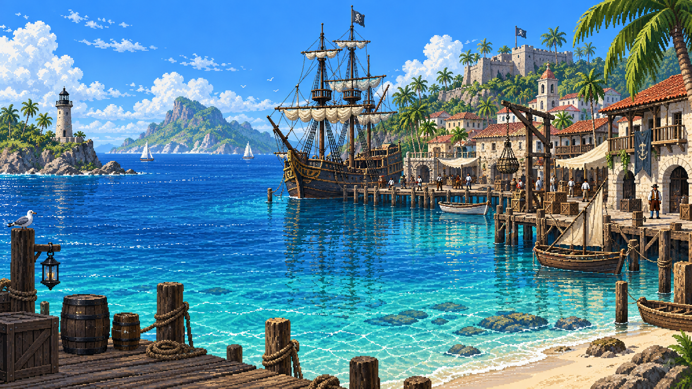

# One Life At Sea: plan för första bygget

Status: **Första grunden är implementerad och verifierad lokalt.**

Datum: 2026-09-15. Version: 0.8. Konto och karaktär skapas tillsammans. E-postbekräftelse är avstängd för utveckling.

Senare beslut om kapten, skepp, besättning, överlevnad, strid och färdigheter
samlas i [designunderlaget](COMBAT_AND_PROGRESSION_DESIGN.md). De är planerade
spelsystem och ingår inte i den ursprungliga första grunden. Det efterföljande
steget med resurser och träning beskrivs i [träningsgrunden](TRAINING_FOUNDATION.md).

## 1. Målet

En spelare ska kunna skapa ett konto, skapa sin första karaktär och komma in i en
stämningsfull hamn. Efter utloggning och ny inloggning ska samma karaktär finnas kvar.

Första bygget ska ge ett komplett flöde med verklig inloggning och sparade data.
Hamnen är spelarens första plats i världen. Aktiviteter kommer i senare etapper.

## 2. Överenskommen riktning

- Spelets namn är One Life At Sea.
- Browserbaserat spel med text, menyer, bilder och beslut.
- Första etappen: konto, karaktär och hamn.
- Spelargränssnittet är på engelska, inklusive felmeddelanden och kontomejl.
- Karaktärsnamnet väljs vid registreringen. Konto och karaktär skapas tillsammans.
- Exakt en karaktär skapas per nytt konto. Fler karaktärer kan inte läggas till.
- Startplatsen visas som **The Harbor**. Inget särskilt hamnnamn behövs nu.
- Hamnvyn har en vänsterpanel med val; innehållet visas till höger om panelen.
- Första menyn innehåller The Harbor, Marketplace och Shipyard. De två senare
  öppnar tills vidare platshållarvyer utan spelmekanik.
- Den tidigare genererade hamnbildens pixelartstil behålls. Färg och atmosfär
  är nu karibiska: ljusblått hav, sandstrand, gröna palmer och tydligt blå helhet.
- Gränssnittet ska inspireras av Torn och klassiska browserspel: tätare
  informationsstruktur, grupperad vänsternavigation och tydligt inramade innehållssektioner.
- TypeScript, Next.js, React, Tailwind CSS och PostgreSQL.
- Supabase Free till att börja med.
- En befintlig Linux-VPS finns som möjlig resurs senare.
- Visuell riktning: detaljerad pixelart, soligt karibiskt hav, träfartyg och palmer.
  Formulär och text ska vara tydligt läsbara.

## 3. Val för första utvecklingsversionen

| Fråga | Förslag för första bygget | Skäl |
| --- | --- | --- |
| Kontohantering | Supabase Auth med e-post och lösenord | Passar vald plattform och hela inloggningsflödet. |
| E-postbekräftelse | Avstängd under den första utvecklingsfasen | E-post och lösenord räcker; spelaren loggas in direkt efter registrering. |
| Karaktärer per konto | En karaktär, skapad samtidigt som kontot | Databasen garanterar sambandet och förhindrar en andra karaktär. |
| Karaktärsnamn | Ifyllt och unikt, fria tecken och ingen spellängdsgräns | Namnreglerna har förenklats för utveckling. |
| Namnregler | Bokstäver, mellanslag, bindestreck och apostrof | Tillåter svenska namn. Versaler och överflödiga mellanslag ger inte nya namn. |
| Startutrustning | Inget skepp eller någon utrustning ännu | Startresurser beslutas tillsammans med kommande aktiviteter. |
| Visuell form | Havsblå paneler, ljusblått hav, sandtoner och en hamnillustration | Sammanhängande värld genom hela flödet. |
| Körning | Lokal Next.js-app och lokal Supabase i Docker | Molnprojektet kunde inte skapas eftersom kontots två gratisplatser är upptagna. |

## 4. Spelarens väg

### Ny spelare

1. Öppnar spelet och väljer **Create account**.
2. Anger karaktärsnamn, e-postadress, lösenord och bekräftelse av lösenordet.
3. Ser namnförhandsvisningen **Captain [name]** i samma formulär.
4. Trycker på **Create account**. Konto och karaktär skapas tillsammans.
5. Loggas in direkt och kommer till **The Harbor**.

Om namnet är upptaget eller ogiltigt skapas inget konto. Spelaren kan välja ett
annat namn och försöka igen med samma e-postadress.

### Återvändande spelare

- Inloggad med karaktär: direkt till hamnen.
- Ett äldre utvecklingskonto utan karaktär kan slutföra sitt namnval en gång.
  Nya registreringar använder alltid det samlade flödet.
- Utloggad: logga in och fortsätt från rätt steg.
- Glömt lösenord: begär återställningsmejl och välj nytt lösenord.

Uppdatering av sidan och avbrutna eller upprepade försök får inte skapa extra karaktärer.

## 5. Vyer och innehåll

Plantexten är på svenska. All text som spelaren möter ska vara på engelska.

### A. Skapa konto och logga in

Spelets namn överst. Solig karibisk hamnillustration i ett eget bildfält eller en sidopanel.
Formuläret får en lugn, ogenomskinlig bakgrund.

Registrering:

- **Your life at sea starts here** och en kort introduktion.
- Karaktärsnamn med namnförhandsvisning, e-postadress, lösenord och bekräftelse av lösenordet.
- Visa/dölj lösenord. Utvecklingsversionen kräver endast minst 6 tecken, utan komplexitetskrav.
- **Create account** och länk till **Log in**.

Inloggning:

- E-postadress, lösenord och **Log in**.
- **Forgot password?** och länk till registrering.

Fel visas vid berört fält eller i ett tydligt formulärmeddelande. Inmatning som är
säker att behålla finns kvar efter fel. Pågående arbete visas och upprepade klick
förhindras medan begäran behandlas.

### B. Lösenordsåterställning

Små stödvyer med samma visuella stil:

- Begär återställning med neutralt svar oavsett om kontot finns.
- Välj nytt lösenord efter giltig återställningslänk.
- Begripliga fel för utgångna eller ogiltiga länkar.
- Lokal testinkorg tar emot utvecklingsmejl utan externa utskick.

Registrering har inget bekräftelsemejl eller bekräftelsesteg i denna version.

### C. Karaktären skapas vid registrering

- **Character name** finns i registreringsformuläret, med namnregler och förhandsvisning.
- Förhandsvisningen visar **Captain [name]**.
- **Create account** sparar både konto och karaktär och öppnar hamnen.
- Inget separat karaktärssteg behövs för nya konton.
- Servern validerar namnet. Databasen garanterar unikhet och en karaktär per konto.
- Misslyckat skapande av karaktären avbryter även skapandet av kontot.
- Samtidiga försök med samma namn ger en vinnare och ett begripligt fel till den andra.

Porträtt, klass, bakgrundshistoria, egenskapspoäng och yrkesval ingår inte.
Namnbyte efter skapandet tillhör en senare etapp.

### D. The Harbor: vänsterpanel och innehållsyta

På dator består hamnvyn av en gemensam toppyta och två kolumner:

1. Kompakt sidhuvud med spelets namn och en återhållsam maritim form.
2. Till vänster: karaktärsinformation, hamnens navigationsrader och kontolänkar
   i separata, tydligt rubricerade grupper.
3. Till höger: en smal platsrad och innehållssektioner med tunna ramar och rubriklister.
4. **Log out** finns i kontogruppen och är även tillgänglig på mobil.

Menyn innehåller till att börja med:

| Knapp | Innehåll till höger | Första byggets funktion |
| --- | --- | --- |
| The Harbor | Hamnillustration, välkomsttext och platslista | Startvy efter inloggning eller skapad karaktär. |
| Marketplace | Rubrik, kort miljötext och **Coming later** | Klickbar dummyknapp som öppnar en platshållarvy. |
| Shipyard | Rubrik, kort miljötext och **Coming later** | Klickbar dummyknapp som öppnar en platshållarvy. |

Det aktiva valet markeras tydligt. Panelen och toppytan finns kvar när innehållet
växlar. Marketplace och Shipyard är klickbara från början så att vi kan använda
och bedöma navigationen, men de utför inga spelhandlingar och ändrar inga speldata.

Fler menyval kan läggas till senare. Marketplace och Shipyard är de första exemplen.

#### Innehåll när The Harbor är valt

- Rubriken **The Harbor** och en kort platsbeskrivning.
- En stor hamnillustration i den valda bildstilen.
- En kort välkomsttext direkt under illustrationen.
- En kompakt lista, **Around the harbor**, med länkar till Marketplace och Shipyard.
  Båda är märkta **Coming later** och öppnar samma dummyvyer som vänstermenyn.
- Karaktärsnamn, nuvarande plats och skapandedatum visas i vänsterpanelens
  **Character**-sektion och finns kvar när vald hamnvy ändras.

Förslag till välkomsttext:

> Salt in the air. Sunlight on the water. Beyond the palms, the open sea waits.

E-postadressen visas inte i den spelmässiga presentationen. Illustrerade skepp
innebär inte att spelaren äger något av dem. Hamnen innehåller inga påhittade
guldvärden, hälsomätare, uppdrag eller spelarräknare.

#### Innehåll i platshållarvyerna

Marketplace och Shipyard får varsin kompakt innehållsvy med rubriklist, hamnbild,
en kort miljöbeskrivning och tydlig information om att funktionen kommer senare.
Det finns inga köpknappar, priser, skeppslistor eller andra simulerade spelsystem.
Spelaren kan hela tiden använda vänstermenyn för att återgå till The Harbor.

#### Smala skärmar

På dator och bredare skärmar ligger panelen till vänster. På smala mobiler visas
karaktärsinformation och samma meny ovanför innehållet. Menyn får radbrytas och
knapparna får större tryckytor. **Log out** är fortsatt tillgänglig. Inga delar
kräver horisontell rullning.

## 6. Visuell riktning

Den aktuella designstudien bygger på granskning av Torns officiella dokumentation
om vänstermenyn, offentliga Torn-skärmbilder och en officiell Tribal Wars-skärmbild.
Bilderna används som historiska strukturreferenser. De verifierar inte spelens
senaste inloggade gränssnitt. [Referensanalys och UI-regler](design/UI_DIRECTION.md).

- Sammanhängande spelram med kompakt sidhuvud, cirka 184 px bred vänsterpanel och
  en tydlig innehållsyta till höger.
- Grupperna **Character**, **Harbor** och **Account** i vänsterpanelen.
- Navigationsrader på cirka 34 px på dator, med små ikoner, avdelare och markerat val.
- Tunna ramar, små rubriklister och en lätt materialkänsla i gränssnittets ytor.
- Karibisk färgskala: havsblå paneler, klarblått och turkost vatten, varma
  sandtoner och gröna palmer i bilden. Den övergripande atmosfären är blå.
- Den nya karibiska pixelartbilden används i den färdiga appen och i designskissen.
- Text över rena ytor. Illustrationer placeras i egna bildfält med tydliga kanter.
- Arial eller liknande läsbar brödtext, cirka 13-14 px på dator. Serif används
  främst i spelets namn och några få berättande rubriker.
- Kompakta formulär och rektangulära knappar med högst lätt rundade hörn.
- Samma paneler, typografi och kontroller i registrering, inloggning, återställningsvyer
  och karaktärsskapande.
- Marknad och varv är fortsatt dummyvyer. Vi visar endast beslutade uppgifter;
  inga påhittade resurser, nivåer, spelarräknare eller ekonomiska data.
- Tangentbordsnavigering, synlig fokusmarkering, kontrast och läsbara mobila
  formulär ska kontrolleras. Animation behövs inte i första bygget.

Havsblå paneler är huvudförslaget. Skissen innehåller också ljusa sandfärgade
innehållspaneler med blå rubriklister som ett jämförelsealternativ.
Det är inte ett beslut om en temaväljare i själva spelet.

Ägaren har valt den tidigare bildens pixelartstil och därefter ändrat färgriktningen
till Karibien. Den nya bilden används som bildgrund för denna riktning:

- Detaljerad pixelart med tydliga pixelstrukturer.
- Ljusblått och turkost hav i klart tropiskt dagsljus, med blått djupare vatten.
- Träfartyg, bryggor och en bebyggelse som känns bebodd.
- Sandstrand, gröna palmer, ljusa byggnader och varma trätoner.
- En lugn, skyddad hamn med äventyrskänsla.

Bilden är en stilreferens för fortsatt arbete. Den fastställer inte hamnens
geografi, vilka byggnader som får funktioner eller vilket skepp spelaren äger.

[Referensbild och ursprung](design/STYLE_REFERENCE.md).
Den klickbara skissen visar layout och exempeldata med den nya karibiska bilden.
En WebP-kopia används för visningen. Både den tidigare bilden och den nya
genererade bildens original bevaras oförändrade.
Inga konton eller speldata skapas i skissen.

## 7. Teknisk avgränsning

### Webbapp

- TypeScript med strikt typkontroll.
- Next.js App Router och React.
- Tailwind CSS med gemensamma färger, avstånd och formulärkomponenter.
- Serverkontroll av session och behörighet vid läsning och ändring.
- Klientkod för interaktion som namnförhandsvisning.
- Spelregler och databasåtkomst separeras från sidornas presentation.

### Konto och data

- Supabase Auth hanterar konton, lösenord, återställning och sessioner.
- E-postbekräftelse är avstängd för den första utvecklingsversionen.
- PostgreSQL lagrar karaktärer och startplats.
- Konto och karaktär har separata ID:n. Uppdatering 2026-09-19: permanent karaktärsdöd
  är borttagen; [Hospital](HOSPITAL.md) ersätter döds- och arvssystemet.
- Minsta karaktärsdata: ID, kontoägare, visningsnamn, normaliserad namnnyckel,
  startplats och tidpunkt för skapande.
- En databas-trigger skapar karaktären i samma transaktion som kontot.
- Databasen förhindrar dubbla namn och mer än en karaktär per konto.
- Namnets tillgänglighet kan kontrolleras som ja/nej utan åtkomst till karaktärsrader.
- Databasändringar sparas som reproducerbara migrationer i projektet.
- Supabases typade klient och SQL-migrationer föreslås räcka. Ett ytterligare ORM
  behöver inte införas för dessa få operationer.

### Åtkomst

- Spelaren får endast läsa sin egen privata karaktärsdata i första bygget.
- Servern kopplar karaktärsskapandet till det inloggade kontot. Klienten får
  inte välja kontoägare, startplats eller framtida spelvärden.
- Tabellbehörigheter och RLS, databasens regler för enskilda rader, ska upprätthålla
  detta även vid direkta API-anrop.
- Hemliga nycklar stannar på servern och utanför Git.
- Sessionsuppgifter, lösenord och bekräftelselänkar får inte hamna i loggar.
- Skydd mot upprepade auth-försök och cachelagring av privata svar ingår.

### Miljö och drift

- Lokal utveckling med dokumenterade startkommandon.
- En `.env.example` med variabelnamn och platshållare, aldrig hemliga värden.
- Supabase Free är fortsatt målet för molnet. Skapandet i Auxron stoppades av
  gränsen på två aktiva gratisprojekt. Lokal Supabase används tills en plats finns.
- Auth-länkar konfigureras för den lokala appadressen.
- E-postleverantör behöver väljas innan externa testare använder det riktiga
  kontoflödet. Supabases standardutskick är begränsat till projektteamets adresser.
- VPS, domän, publik deployment och driftövervakning ingår inte i första bygget.
- Gratisplanens begränsningar och säkerhetskopiering bedöms före publik test.
  Auth-kvoten är inte en kapacitetsgaranti för spelet.

## 8. Ingår inte

- Expeditioner, omröstningar och bakgrundssimulering.
- Fiske, matlagning, handel och hantverk. Marketplace ingår endast som
  navigationsknapp och platshållarvy.
- Skeppsägande, utrustning, inventarium och ekonomi. Shipyard ingår endast som
  navigationsknapp och platshållarvy.
- Strid, PvP och skador låg utanför första bygget och har implementerats senare.
  Idén om permanent död har ersatts av Hospital.
- Guilds, chatt, vänner och topplistor.
- Porträttväljare, klasser och avancerad karaktärsredigering.
- Betalningar, administratörsgränssnitt och publik hosting.

## 9. Byggordning efter överenskommen plan

1. **Projektgrund:** verktyg, beroenden, miljövariabler, grundlayout och kontroller.
2. **Datagrund:** Supabase-koppling, migrationer, namnregler och åtkomstregler.
3. **Kontoflöde:** registrering med karaktärsnamn, direkt inloggning, återställning och utloggning.
4. **Karaktär:** skapande samtidigt med kontot, valideringsfel och skydd mot dubbletter.
5. **Hamn:** vänsterpanel, växling av innehåll, platshållarvyer, illustration
   och visning av sparad karaktär.
6. **Verifiering:** automatiserade kontroller, webbläsarflöde och dokumenterade resultat.

## 10. När är första bygget klart?

- Nytt konto registreras med karaktärsnamn, e-post och lösenord och blir direkt inloggat.
- Lösenordsåterställning fungerar; ogiltiga länkar hanteras.
- Karaktären skapas med kontot och spelaren kommer direkt till hamnen.
- Ogiltiga och upptagna namn ger begripliga fel.
- Samtidiga eller upprepade försök skapar inte dubbla karaktärer.
- Uppdatering, utloggning, ny inloggning och omstart av webbappen behåller data.
- Nya konton kan inte skapas utan karaktär. Äldre ofärdiga konton kan slutföra sitt namnval.
- Utloggade besökare kan inte läsa hamnens privata karaktärsdata.
- Två testkonton kan inte läsa eller ändra varandras privata data.
- Manipulerade anrop får inte byta ägare eller startplats.
- Vänsterpanelen markerar aktivt val och visar motsvarande innehåll till höger.
- Marketplace och Shipyard öppnar rätt platshållarvy utan att ändra speldata.
- The Harbor öppnar åter hamnöversikten. Panelen och toppytan finns kvar.
- Alla övriga knappar och länkar har en fungerande uppgift.
- Mobil, dator och tangentbordsnavigering fungerar. Text, menyval och formulär
  behåller sin läsbarhet även i den kompakta layouten.
- Lint, typkontroll, produktionsbygge och relevanta automatiserade tester har körts.
- README beskriver start och verifiering. Resultat och kvarstående begränsningar
  redovisas utan att kalla obekräftade steg godkända.

Utförda kontroller och återstående begränsningar redovisas i
[implementationsstatus](IMPLEMENTATION_STATUS.md).

## 11. Fortsättning efter den lokala grunden

- Frigör eller ordna en Supabase Free-plats innan molnanslutningen görs.
- Konfigurera extern e-postleverans för lösenordsåterställning inför externa testare.
- Besluta separat om e-postbekräftelse ska återinföras inför publik användning.
- Ägaren har valt nästa steg: tre resursmätare samt Crew Training och Ship Upgrades.
  Omfattning och regler finns i [träningsgrunden](TRAINING_FOUNDATION.md).

## Referenser

- Ägarens bifogade spelkoncept och beslut i denna konversation.
- [Supabase med Next.js](https://supabase.com/docs/guides/auth/server-side/creating-a-client?queryGroups=framework&framework=nextjs)
- [Supabase e-postleverans](https://supabase.com/docs/guides/auth/auth-smtp)
- [Supabase-planer](https://supabase.com/pricing)
- [Next.js på egen server](https://nextjs.org/docs/app/guides/self-hosting)

