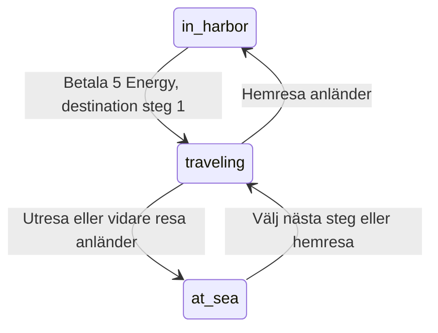

# Plan: stegvisa resor till havs

Datum: 2026-09-20. Status: implementerad lokalt. Se [aktuellt beteende](SEA_TRAVEL.md) och [verifiering](IMPLEMENTATION_STATUS.md).

Terminologin har senare ändrats från steg till **Sea distance**, med **Max sea distance**
på profilen. [Scouting och havs-PvP](SEA_SCOUTING.md) har därefter implementerats
och ersätter det tidigare uppskjutna PvP-beslutet. [Energy på fasta klockslag](ENERGY_RECOVERY.md)
ersätter även planens energipaus: +5 var femte minut i hamnen och var tionde minut till havs,
inklusive resor. Plantexten nedan bevarar det ursprungliga designunderlaget.

Planen bygger på ägarens beskrivning och förtydliganden samt genomgång av
projektets kod. Senaste beskedet om PvP ersätter det tidigare: PvP till havs
väntar på ett separat framtida system. Denna etapp gör resandet spelbart.

## 1. Beslutade spelregler

| Regel | Första versionen |
| --- | --- |
| Avfärd | Kostar 5 Energy och kräver minst 5 tillgänglig Energy. |
| Första resan | Tar 60 sekunder och slutar precis utanför hamnen, på steg 1. |
| Resealternativ | Två slumpade alternativ vid varje ankomst till en havsplats. |
| Synlighet | Platstyperna visas före valet; de två alternativen har olika typer. |
| Avstånd | Båda alternativen går från steg N till steg N + 1. |
| Vidare resa | Kostar 0 Energy och tar 60 sekunder per vald förflyttning. |
| Upprepning | Samma platstyp kan återkomma på senare steg. |
| Hemresa | Från varje havsplats, direkt till hamnen; kostar 0 Energy och tar N minuter från steg N. |
| Under resa | Spelaren är mellan platserna och kan inte utföra spelhandlingar. |
| Avbryta | Ingen utresa, vidare resa eller hemresa kan avbrytas. |
| Energy | Ingen passiv återhämtning från avfärd till faktisk återkomst i hamnen. |
| Hamnaktiviteter | Otillgängliga under hela vistelsen till havs. |
| Skeppsarbete | Ett pågående Ship Upgrade måste bli klart före avfärd. |
| Strid | Varken angripare eller försvarare får börja resa under pågående strid. |
| PvP till havs | Införs senare. Spelare till havs kan i denna etapp varken attackera eller bli attackerade. |
| Platsaktiviteter | Fiske, handel, utforskning och liknande införs senare. |

Ingen vidare resa startar automatiskt efter ankomst. En ny avfärd efter hemkomst
kostar åter 5 Energy. Hemresan kräver inga val genom tidigare besökta platser.

## 2. Arbetsförslag och avgränsning

Följande är föreslagna implementationsval, inte nya uttryckliga ägarbeslut:

- Fyra slumpbara typer: `deserted_island`, `village_island`, `deep_water` och
  `sharp_rocks`. `harbor_outskirts` är den fasta första platsen och ingår inte
  i slumpningen längre ut.
- Samma sannolikhet för alla fyra typer; välj två utan återläggning. Typen på
  nuvarande plats får återkomma vid nästa steg, då som ett nytt besök.
- Varje besök och dess alternativ sparas för spelaren. Omladdning, en annan flik
  eller inloggning ger inte nya alternativ.
- Ingen spelmässig maxgräns för steg. Tekniska gränser för tal och datum ska ändå
  valideras utan overflow, debitering eller halvfärdiga tillstånd.
- Resan fortsätter offline. Serverns klocka avgör när spelaren anländer.
- Ett delvis intjänat återhämtningsintervall för Energy pausas och återupptas
  efter hemkomst. Havstiden ger aldrig återhämtning.
- Befintlig återhämtning av Ship Health och Crew Health behålls.
- Profiler och inventory får läsas på en stillastående havsplats. Första etappens
  spelhandlingar där är resa vidare och hem; inventorymutationer och ändring av
  försvarsorder spärras. Under resa visas vänteläget.
- Log out och nödvändiga kontoflöden fungerar under resa. Behörig admin behåller
  projektets befintliga undantag för administratörssidor.

Ingen delad karta eller regel om vilka spelare som är på samma ö införs.
Besöks-ID identifierar spelarens besök, inte en global geografisk plats.
Framtida PvP ska kunna tillföra gemensamma platsidentiteter utan att resesystemet
antar att samma steg och platstyp betyder samma fysiska plats.

## 3. Historisk utgångspunkt före implementation

Detta är verifierat genom kodläsning, inte genom en ny spel- eller testkörning.

| Befintlig del | Vad resorna behöver ändra eller återanvända |
| --- | --- |
| `public.characters.location` | SQL och TypeScript tillåter bara `the_harbor`; båda behöver utökas. |
| `private.energy_snapshot` | Bevarar delintervall och begränsar Energy till kapaciteten. Anropas av game state, träning och strid. |
| `get_game_state` | Ska även returnera aktuellt reseläge och ankomstdeadline. |
| `private.settle_combat_context` | Befintlig låsordning samt färdigställande av förfallna strider och Hospital. |
| Skeppsarbete | Sparad sluttid och färdigställande vid serveråtkomst, även efter offlineperiod. |
| Bank och träning | Har redan databasvillkor för `the_harbor`. |
| Stridsstart och preview | Saknar resevillkor; både angripare och mål behöver kontrolleras. |
| `get_navigation_lock`, Proxy, `AppFrame` | Samordnar Hospital och stridslås för direktlänkar och klientnavigation. |
| `GameStateProvider`, `useServerCountdown` | Återanvänd för deadlines och nedräkning från serverns observationstid. |
| `player_game_events` | Ägarskyddad revisionssignal för uppdatering mellan flikar. |
| Hamnlista och profiler | Platsprojektioner uppdateras vid skrivning; offlineankomst kräver tidsmedveten läsning. |
| Admin | Energyredigering flyttar återhämtningsankaret och måste även respektera energipausen. |

SQL-logiken underhålls i `supabase/templates/gameplay/` och genereras till nya
migrationer. `tests/e2e/first-voyage.spec.ts` testar kontoflöden trots namnet;
den nya funktionen ska få ett separat `sea-travel.spec.ts`.

## 4. Tillstånd och övergångar

| Tillstånd | Innehåll | Reseval |
| --- | --- | --- |
| `in_harbor` | Hamn, steg 0, ingen aktiv resa eller havsplats. | Lämna hamnen om villkoren uppfylls. |
| `at_sea` | Besöks-ID, platstyp, steg N och två sparade alternativ. | Välj nästa steg eller hemresa. |
| `traveling` | Resans ID, slag, ursprung, destination, starttid och ankomsttid. | Inga. |



Steget ökar vid ankomst, inte vid klicket. Under resa är ursprung och destination
metadata; spelaren har ingen tillgänglig aktuell plats. Under hemresa är spelaren
fortfarande utanför hamnen. Hospital och strid behåller sina befintliga system;
databasregler förhindrar oförenliga kombinationer av strid och resa.

## 5. Konfiguration och lagring

Lägg resevärden i `config/gameplay.json` med motsvarande validering i
`config/schema.json` och `scripts/config/core.mjs`:

| Föreslaget fält | Startvärde |
| --- | --- |
| `seaTravel.departureEnergyCost` | `5` |
| `seaTravel.outwardDurationSeconds` | `60` |
| `seaTravel.returnSecondsPerStep` | `60` |
| `seaTravel.locationTypes` | De fyra typerna med stabila ID:n och visningsnamn. |

Exakt två alternativ är en regel i första versionen. Config måste innehålla minst
två aktiva typer med unika ID:n. Påbörjade resor behåller sparad sluttid och
destination vid configändringar. Redan erbjudna alternativ behåller sin giltighet.

Föreslagen datamodell:

- Utöka den ägarskyddade karaktärsraden med steg, aktuellt besöks-ID och platstyp,
  aktiv resas metadata, reseversion och `energy_paused_at`. Befintliga `location`
  skiljer mellan `the_harbor`, `open_sea` och `traveling` och bestämmer reseläget.
- En privat alternativtabell kopplar varje alternativ-ID till karaktär, besök
  och sparad destinationstyp. Klienten väljer ett alternativ-ID, inte fritt steg
  eller destination.
- Privata kvitton har unik kombination av karaktär och `request_id` samt lagrar
  begärans innehåll och resultat för säkra återförsök.
- Constraints och atomiska kommandon garanterar giltiga tillstånd: positiva
  restider, nästa steg vid utresa, steg 0 vid hemresa, inga resfält i hamn och
  energipaus i samtliga havslägen. Ett anlänt besök har exakt två olika alternativ.
- Befintliga och nya karaktärer börjar i hamnläget. Migrationen bevarar resurser,
  progression, ekonomi, stridshistorik och befintliga skeppsarbeten.
- RLS och återkallade skrivbehörigheter förhindrar direkta klientändringar.
  Privat resedata, slumpresultat och återhämtningsankare ägs av servern.

Slumpningen sker en gång per besök under karaktärslås. Förbered nästa besök och
dess alternativ när resan startar, men exponera inte de nya alternativen före
ankomst. Därmed påverkar varken omladdning eller senare katalogändring en redan
startad resa. Ingen framtida karta behöver förgenereras.

## 6. Serverhandlingar, tid och samtidighet

| Föreslaget kommando | Serverns ansvar |
| --- | --- |
| `depart_harbor` | Kontrollera hamn, Hospital, strid, färdigt skeppsarbete och Energy; dra 5 och starta resan till steg 1 atomiskt. |
| `choose_sea_route` | Kontrollera besöks-ID och erbjudet alternativ; starta resa till N + 1 utan debitering. |
| `return_to_harbor` | Kontrollera havsplats och steg; spara direkt hemresa med N gånger aktuell tid per steg. |

Kommandona autentiserar ägaren och använder samma låsordning som stridssystemet.
Förfallna resor, strider, Hospital och skeppsarbeten hanteras innan nya villkor
bedöms. Samordna ordningen uttryckligt och undvik rekursion mellan settlementfunktioner.

- Alla kommandon innehåller serverns förväntade reseversion, även avfärd och
  hemresa. Fördröjda anrop från ett tidigare varv får inte starta en ny resa.
- Samma `request_id` och innehåll ger sparat kvitto utan ny kostnad, slumpning
  eller resa. Samma ID med ändrat innehåll ger konflikt.
- Två olika samtidiga kommandon mot samma version kan inte båda vinna.
- Gamla alternativ och besöks-ID:n avvisas. Klienten får inte välja egen ankomsttid.
- Samtidig attack och avfärd serialiseras: attack först blockerar avfärd;
  avfärd först blockerar attacken. Regeln omfattar även försvarare.
- Återspelat kvitto är ingen ny handling. Hämta aktuellt game state efter svaret
  så att ett gammalt kvitto inte återställer klienten till ett äldre reseläge.

En privat funktion färdigställer förfallna resor under lås. Game state,
navigationskontroll och berörda mutationer använder den. Ankomsten gäller vid
`arrives_at`, även om serveråtkomsten sker senare. Upprepat färdigställande är
ofarligt. Ingen öppen flik, webbläsartimer eller bakgrundsworker krävs.

Klientens nedräkning begär en serversnapshot vid noll; den låser aldrig själv upp
handlingar. Vid nätfel visas väntan på bekräftad ankomst. Revisionssignaler skickas
vid verkliga tillståndsändringar, inte varje sekund eller vid oförändrade läsningar.

## 7. Energy utan retroaktiv återhämtning

1. Beräkna intjänad hamn-Energy vid avfärd, dra 5 och spara paustiden atomiskt.
2. Alla havslägen returnerar fryst Energy och `energy_next_at = null`.
3. Vid hemkomst flyttas återhämtningsankaret fram med pausens längd. Tidigare
   delintervall bevaras; full Energy får fortfarande inte lagra extra tid.
4. Vid sen återinloggning räknas bara tiden efter faktisk hemkomst som ny
   återhämtning, plus eventuellt bevarat delintervall.

Exempel: 50 Energy och en minut kvar till nästa tillskott blir 45 vid avfärd.
Efter 20 minuter till havs kommer kaptenen hem med 45 och får nästa tillskott
efter ytterligare en minut i hamnen.

Behåll den befintliga rena intervallberäkningen och lägg platsmedveten
energiavläsning i en gemensam serverfunktion. Uppdatera alla anrop i game state,
träning och strid. Adminändrad Energy måste uppdatera ankare och paus konsekvent;
generisk redigering av resefält ska inte öppnas i denna etapp.

## 8. Integration med befintliga system

**Spelhandlingar:** Bank, träning, nivåköp och skeppsarbete är hamnhandlingar.
Inventorymutationer och försvarsorder får havsspärr enligt arbetsförslaget.
Kontrollera både databaskommandon och UI; en inaktiv knapp är inte en spelregel.

**Strid:** Preview, start och Join battle kontrollerar båda spelarnas effektiva
plats efter eventuell ankomst. Efter hemkomst gäller befintliga regler för
hamn-PvP. Resan ger inget nytt skydd och återställer inte tidigare skyddsperioder.

**Hospital:** Ingen avfärd under vistelsen. Förfallen utskrivning behandlas före
avfärdsvillkoren. Om administrativ skada ändå utlöser Hospital till havs vinner
den befintliga sjukhusregeln: resa och havsval avslutas och energipausen slutar
vid faktisk intagning. Havstiden ger ingen retroaktiv Energy. Detta är integration
med befintlig intagning, inte ett nytt skade- eller räddningssystem.

**Skeppsarbete:** Ett passerat slutdatum räknas som färdigt även om UI ännu visar
arbetet. Belöningen tillämpas en gång före avfärd. Ofärdigt arbete blockerar.

**Hamnlista och profiler:** Kaptenen lämnar hamnlistan vid avfärd och räknas som
tillbaka vid hemresans deadline, även offline. Profiler skiljer mellan hamn,
till havs och under resa utan att exponera privata alternativ eller resurser.

Dagens projektioner ändras vid skrivning av karaktären. Att vänta på kaptenens
nästa inloggning skulle därför ge fel plats för andra spelare. Komplettera med
minimal serverägd ankomstinformation och låt list-/profilfunktioner beräkna
effektiv plats från databastid. Bevara minimal offentlig identitet och RLS;
publicera inte hela karaktärsraden eller den privata resan.

Öppna listor/profiler behöver nästa relevanta ankomstdeadline, uppdatering vid
fokus/återanslutning och reservkontroll. En passerad deadline ger i sig ingen
Realtimehändelse. Läsning ska inte behöva låsa eller uppdatera alla kaptener.
Samma ankomstvillkor används i läsvyer, färdigställande och attackvalidering.

## 9. Gränssnitt, navigation och berörda filer

- Hamnen får `Set sail`, med kostnad, restid och begripligt skäl när avfärd är spärrad.
- `/sea` visar plats, `Step N from harbor`, två alternativ med restid samt
  `Return to harbor` med hela hemresetiden.
- Samma rutt visar destination och nedräkning under resa. Inga nya reseval eller
  hemresor kan startas innan ankomsten bekräftats.
- Sidopanelen visar aktuell plats/resestatus; Energytexten visar pausad återhämtning.
- Lägg ankomstdeadline i `GameStateProvider` och återanvänd `useServerCountdown`.
  Befintliga revisionssignaler och återanslutningsflöden uppdaterar andra flikar.
- Synkronisera resepolicyn i `get_navigation_lock`, Proxy, rotlayout och `AppFrame`.
  Hospital har företräde; befintliga stridslås kvarstår. Direktlänkar, cachade
  sidor, back/forward och gamla formulär får inte kringgå resevillkoren.
- Startsida, inloggning och återkomst till en flik visar rätt reseläge. Hemkomst
  leder till hamnen utan omdirigeringsloopar. Kontoflöden och utloggning fungerar.
- Återanvänd paneler och mobilregler. Karta, nya illustrationer och animationer
  är inga beroenden för denna funktionsetapp.

| Område | Huvudsakliga filer, nya filer är förslag |
| --- | --- |
| Config | `config/gameplay.json`, `config/schema.json`, `scripts/config/core.mjs` |
| Databas | Ny schema-migration, ny `supabase/templates/gameplay/sea-travel.sql`, inkluderingsordning i `gameplay.sql`, nya genererade migrationer |
| Integration | SQL-delarna `resources.sql`, `game-state.sql`, `combat.sql`, `hospital.sql`, `training.sql`, `bank.sql`, `inventory.sql`, `profile.sql`; projektioner och adminfunktioner |
| Typer och kommandon | Ny `src/lib/sea-travel.ts`, ny `src/app/sea-actions.ts`, `src/lib/game.ts`, `database.types.ts`, `player.ts` |
| UI | Ny `src/app/(game)/sea/page.tsx`, nya resekomponenter; hamnsida, layouter, `app-frame.tsx`, `game-state.tsx`, `harbor-nav.tsx`, `resource-bars.tsx`, `profile-details.tsx`, `src/proxy.ts` |
| Tester | Nya `supabase/tests/sea-travel.test.sql`, `tests/unit/sea-travel.test.ts`, `tests/e2e/sea-travel.spec.ts`; relevanta regressionstester och configtester |

## 10. Genomförande i fem etapper

1. **Kontrakt och lagring:** config, typer, constraints, alternativ och kvitton.
   Skapa nya migrationer med Supabase CLI och befintlig configgenerator; ändra
   inga historiska migrationer. Kontrollpunkt: bevarade spelardata, giltiga
   tillstånd och avvisade direkta klientändringar.
2. **Serverns reseloop:** de tre kommandona, sparad slumpning, tidsstyrd ankomst,
   energipaus och återförsök. Kontrollpunkt: hamn, steg 1, steg 2 och hem fungerar
   via verkliga RPC-anrop med korrekta tider och utan dubbel debitering.
3. **Integration och åtkomst:** strid, Hospital, skeppsarbete, spelhandlingar,
   admin och tidsmedvetna platsprojektioner. Kontrollpunkt: direkta API-anrop och
   gamla flikar kan inte kringgå regler; andra spelare ser offlinehemkomst rätt.
4. **Spelbar resevy:** avfärd, `/sea`, alternativ, vänteläge, hemresa och navigation.
   Revalidera även rotlayouten vid lägesbyte eftersom `AppFrame` finns där.
   Kontrollpunkt: mobil, dator, tangentbord, reload och återinloggning fungerar.
5. **Samlad verifiering:** kör kontrollerna nedan och rätta upptäckta fel.
   Uppdatera README, arkitektur, hamnlista, resurser/träning, strid, Hospital och
   admin där beteendet ändras. Redovisa faktiska resultat i implementationsstatus.

## 11. Acceptanskriterier och verifiering

Databas och samtidighet ska täcka:

- 5 Energy dras exakt en gång; 4 Energy ger ingen resa eller annan ändring.
- Första ankomsten är steg 1; båda alternativen leder till exakt N + 1.
- Vidare resa och hemresa fungerar med 0 Energy utan debitering.
- Två olika giltiga alternativ bevaras över omladdning, flikbyte och retry.
- Ingen ankomst före deadline; exakt deadline är ankomst.
- Hemresa från steg 1, 2 och 5 tar 60, 120 respektive 300 sekunder.
- Två samtidiga val, olika request-ID:n, gamla alternativ och gamla reseversioner
  kan inte skapa extra resor, inte heller efter ett helt nytt varv.
- Fryst Energy i alla havslägen; rätt delintervall och kapacitet efter hemkomst;
  lång offlineperiod ger bara återhämtning för faktisk tid i hamn.
- Färdigt skeppsarbete tillämpas en gång; ofärdigt arbete blockerar utan debitering.
- Angripare och försvarare kan inte resa; samtidiga attack-/avfärdsanrop ger
  aldrig både aktiv strid och resa. Havsspärren gäller preview, start och join.
- Bank, träning och andra spärrade handlingar nekas även direkt via RPC.
- Offlinehemkomst syns i en annan spelares hamnlista, profil och attackvalidering.
- Adminändrad Energy och Hospital-intagning bryter inte energipaus eller resemodell.
- Anonyma och andra konton kan inte läsa privata alternativ eller ändra resedata.
- Nya configtider påverkar nya resor men ändrar inte påbörjade resors sluttider.

Webbläsare och regression ska täcka:

- Hela varvet via minst två steg; korrekt plats, pausad Energy och låsta resehandlingar.
- Reload, back/forward, direktlänkar, flera flikar, nätfel och återanslutning.
- Utloggning under utresa och hemresa samt rätt läge vid återinloggning.
- En annan kapten ser avfärd och hemkomst även när resenären är utloggad.
- Befintliga kontoflöden, hamn-PvP, profiler, Hospital, bank, inventory och träning.
- Läsbar mobilvy, tangentbordsnavigation, fokusmarkering och tillgänglig status.

Använd isolerade lokala testkonton och gemensamma testhjälpare. SQL-tester kan
styra tidsvärden; längre webbläsarförlopp kan använda lokala serverfixtures.
Ändrad webbläsarklocka bevisar inte serverankomst. Prova samtidighet via separata
anslutningar och minst en faktisk 60-sekundersresa med ordinarie utvecklingsvärden.

Planerade kommandon efter implementation och start av lokala beroenden:

```text
npm run config:check
npm run check
npm run test:db
npm run test:config:db
npm run test:e2e
```

Hela webbläsarsviten behövs eftersom delad navigation och game state ändras.
Äldre tester som tillfälligt tar bort `characters_start_location` ska anpassas
till resmodellen utan försvagade behörighetskontroller. Återställ inte användarens
lokala databas eller testkonton för att genomföra verifieringen.

## 12. Planleverans och referenser

Den ursprungliga planleveransen ändrade bara dokumentation. Funktionen har därefter
implementerats enligt detta underlag. Aktuellt serverkontrakt, config och gränssnitt
beskrivs i [resesystemet](SEA_TRAVEL.md); körda kontroller finns i
[implementationsstatus](IMPLEMENTATION_STATUS.md).

Alla ställda frågor är besvarade. Arbetsförslagen i avsnitt 2 är åtskilda från
ägarens beslut. Framtida PvP och platsaktiviteter planeras separat.

- [Arkitektur](ARCHITECTURE.md), [configflöde](CONFIGURATION.md) och [underhåll](CODE_MAINTENANCE.md).
- [Hamnlista](HARBOR_ROSTER.md), [Hospital](HOSPITAL.md) och [stridssystem](COMBAT_SYSTEM.md).
- Installerad Next.js-dokumentation: `node_modules/next/dist/docs/01-app/01-getting-started/07-mutating-data.md`
  och `node_modules/next/dist/docs/01-app/03-api-reference/03-file-conventions/proxy.md`.
- [Supabase: databasfunktioner och funktionsbehörigheter](https://supabase.com/docs/guides/database/functions).
  Autentiserade kommandon och explicita funktionsbehörigheter följer befintligt
  projektmönster; navigationsskydd ersätter inte kontroll i själva kommandot.
